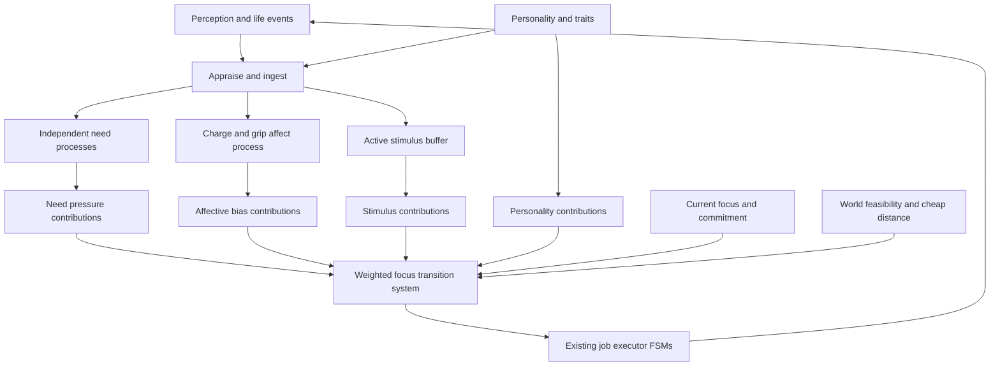
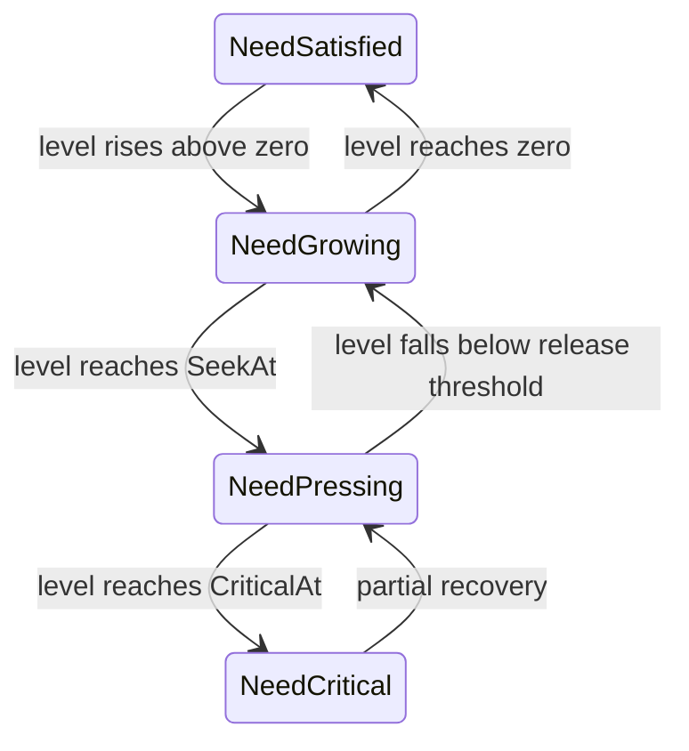

# Cascading internal state and weighted focus

> Part of the [mars-sim documentation](./README.md).

## What it is

This is the implementation design for replacing the colonist AI's fixed
priority ladder with a **weighted focus transition system**. Independent need,
affect, and stimulus processes describe what is happening inside and around a
colonist. They emit explainable score contributions into an executive arbiter,
which decides whether the colonist should keep its current focus or transition
to another one. Existing jobs remain the state machines that execute the chosen
focus.

This is a design document, not shipped behavior. Implement it in the milestones
under [Implementation plan](#implementation-plan), keeping every milestone
building and tested.

## Source

The implementation should introduce or update:

- `internal/sim/focus.go` — focus kinds, candidates, scoring, arbitration, and
  transitions.
- `internal/sim/focus_test.go` — component-level scoring and transition tests.
- `internal/sim/needs.go` — per-need phases and pressure emission, while keeping
  lazy level calculation.
- `internal/sim/affect.go` — charge/grip state, event vectors, decay, appraisal,
  mood labels, and active stimuli.
- `internal/sim/affect_test.go` — vectors, trait transforms, decay, labeling, and
  stimulus tests.
- `internal/sim/systems.go` — the colonist turn pipeline and focus executors.
- `internal/sim/entity.go` — stored focus, need phases, affect, and stimuli.
- `internal/sim/perception.go`, `internal/sim/cognition_config.go`, and
  `internal/sim/world.go` — compositional occurrences/percepts, configured
  reactions, and the single ingestion funnel.
- `internal/sim/config.go` — focus and affect tuning parameters.
- `internal/sim/configfile.go` — config traversal for the focus-spec array.
- `internal/sim/snapshot.go` and `internal/ui/tui/render_roster.go` — visible
  focus and mood state.

Existing references:

- [`needs.md`](./needs.md) — current lazy need levels and urgency rules.
- [`personality.md`](./personality.md) — trait resolution and personality RNG.
- [`memories.md`](./memories.md) — life events, memories, and the one-funnel
  invariant.
- [`entities-and-ai.md`](./entities-and-ai.md) — current jobs and turn order.

## Goals

1. A colonist's next focus is a deterministic function of its current focus,
   needs, affect, active stimuli, personality, and feasible choices.
2. Need, affect, and focus evolve independently. Their state counts add rather
   than multiplying into composite states such as
   `PanickedWhileHungryAndMining`.
3. Decisions are tunable but explainable. A test or debug view can show every
   contribution to every candidate score.
4. Colonists maintain commitments. Small score changes do not cause per-tick
   thrashing.
5. Immediate circumstances and lingering emotion are distinct. A visible alien
   can disappear while the colonist remains shaken.
6. Existing job, pathfinding, claim, starvation, memory, and determinism
   invariants remain intact.
7. Expensive map searches do not move into the scoring loop.

## Non-goals

- Do not replace pathfinding, construction planning, the job board, or job
  executors.
- Do not build one global FSM containing every need, mood, focus, job stage, and
  target.
- Do not use machine learning or tune weights automatically.
- Do not add random noise to focus selection. Existing simulation randomness
  may affect events and conversation quality; arbitration itself is
  deterministic.
- Do not model diagnoses or long-term mental illness in the first
  implementation. Persistent conditions can be added later on top of observed
  affect history.
- Do not make every correctness rule a very large utility weight. Eligibility
  and ownership invariants remain ordinary code.

## Vocabulary

| Term | Meaning |
| --- | --- |
| **Need process** | One continuous need level plus its discrete phase, such as food being `Pressing`. |
| **Affect** | The colonist's continuous `(charge, grip)` point and its current named attractor. |
| **Stimulus** | A bounded, transient appraisal of a recent or ongoing event that may influence the next decision. |
| **Focus** | The goal currently occupying executive attention: eat, sleep, work, flee, and so on. |
| **Candidate** | One eligible focus the arbiter may keep or enter, with its score breakdown and target context. |
| **Job** | The existing execution state (`JobUse`, `JobBuild`, `JobTalk`, etc.) used to carry out a focus. |
| **Commitment** | The preference for continuing a viable current focus rather than switching for a marginal gain. |

## Architecture



Only focus arbitration is literally a weighted state transition system:
outgoing transitions from the current focus are eligible candidates, and the
highest-scoring transition wins if it clears the switching threshold. Needs and
affect are stateful signal producers. Calling all three layers WSTSs obscures
their different dynamics and encourages unnecessary transition matrices.

## Entity state

Use small value types. Names may move between files, but preserve these
responsibilities:

```go
type NeedPhase uint8

const (
    NeedSatisfied NeedPhase = iota
    NeedGrowing
    NeedPressing
    NeedCritical
)

type AffectState struct {
    Charge int // [-MoodMax, MoodMax]
    Grip   int // [-MoodMax, MoodMax]
    Label  MoodKind
}

type FocusKind uint8

const (
    FocusIdle FocusKind = iota
    FocusWork
    FocusEat
    FocusRelieve
    FocusSocialize
    FocusSleep
    FocusFlee
    FocusFight
    numFocusKinds
)

type Stimulus struct {
    Rule      RuleID
    Source    EntityID
    Salience  int
    ExpiresAt int
}
```

Add the following colonist-only fields to `Entity`:

```go
needPhase [numNeeds]NeedPhase
affect    AffectState
focus     FocusKind
focusSince int
stimuli   []Stimulus
```

Do not duplicate job targets in permanent focus state. Candidate context may
carry a need, threat, or cheap target estimate during arbitration, but the
selected executor remains the source of truth for exact targets and claims.

## Need processes

### One machine per need

Do not create one global physiological state such as `Ravenous`. A colonist can
be ravenous, exhausted, socially deprived, and bladder-satisfied at the same
time. Each `NeedKind` owns an independent phase:



The first implementation still resets a need to zero when satisfaction
completes, so the partial-recovery arrows mostly prepare for future mechanics.
Do not add a `Satisfying` need phase: satisfying a need is a focus/job fact, not
a physiological condition. If eating is interrupted, hunger remains pressing
without a fake phase transition.

### Keep lazy levels

Keep the existing base-plus-timestamp calculation. `syncNeedPhase` reads the
lazy level and transitions the phase only:

```go
func (w *World) syncNeedPhase(e *Entity, n NeedKind) (changed bool)
```

Call it before arbitration and after resetting a need. A phase change requests
focus reconsideration but does not itself assign a job.

### Thresholds

Add `CriticalAt` to `NeedSpec`, with a `cfg:"critical-at"` tag. Required
validation:

```text
0 <= SeekAt <= CriticalAt <= Max
```

For the initial committed defaults:

- food: `CriticalAt = Max`; fatality already begins at `Max`;
- bladder: `CriticalAt = 900`;
- social: `CriticalAt = 850`;
- sleep: `CriticalAt = 900`.

Regenerate `mars-sim.yaml` in the same change.

### Pressure

Normalize pressure to `[0, 100]`:

```text
level < SeekAt:
    pressure = 0

SeekAt <= level < CriticalAt:
    pressure = 1 + 74 * (level - SeekAt) / max(1, CriticalAt - SeekAt)

level >= CriticalAt:
    pressure = 75 + 25 * (level - CriticalAt) / max(1, Max - CriticalAt)
```

Clamp the result to `[0, 100]`. The explicit `1` at `SeekAt` makes a threshold
crossing observable even when integer division would produce zero. When
`CriticalAt == Max`, a level at `Max` produces pressure 100.

Only a need at `NeedPressing` or `NeedCritical` emits a candidate in the first
implementation. This preserves the current meaning of `SeekAt`; anticipatory
behavior can later be introduced by allowing `NeedGrowing` to emit a smaller
score.

Map needs to focus:

| Need | Focus |
| --- | --- |
| `NeedFood` | `FocusEat` |
| `NeedBladder` | `FocusRelieve` |
| `NeedSocial` | `FocusSocialize` |
| `NeedSleep` | `FocusSleep` |

Fatal urgent needs receive `FocusFatalBonus`. This preserves the existing rule
that food outranks non-fatal needs when both are urgent.

## Affect process

### Coordinates

Replace the scalar mood with two bounded coordinates:

| Axis | Meaning | Intended behavioral effect |
| --- | --- | --- |
| **Charge** | Energy behind the next action | High favors initiation, work, fight, and rapid reaction; low favors sleep and recovery. |
| **Grip** | Felt purchase on the situation | High favors commitment and confrontation; low favors avoidance and flight. |

Both coordinates live in `[-MoodMax, MoodMax]`. Zero is neutral. Personality may
eventually define a non-zero home point; initialize home to `(0, 0)` in the
first implementation.

### Valence is contextual

Do not store a third good/bad coordinate. Needs, HP, active threats, and recent
events already describe whether circumstances are going well. Valence is used
only when selecting a display name:

| Affect | Circumstances good | Circumstances bad |
| --- | --- | --- |
| high charge, high grip | driven / elated | furious |
| high charge, low grip | giddy | panicked / anxious |
| low charge, high grip | content / composed | grim / hardened |
| low charge, low grip | listless / spent | despairing / numb |

Do not feed derived valence back into focus scoring in the first implementation;
that would count needs, health, and threats twice. Focus scoring consumes the
underlying signals directly.

### Reaction vectors

Compositional reaction rules carry cartesian vectors:

```go
type MoodVector struct {
    Charge int
    Grip   int
}
```

The shipped targets live in the `reactions` section of `cognition.yaml`. A
reaction matches actor/action/object plus channel/role/phase; adding a new
combination is config data rather than another enum-indexed Go row. Keep
high-impact targets at plane scale and low-impact targets nudge-sized.

Conversation outcome remains computed per occurrence. Let the existing
`talkMoodDelta` plus `noteConversation` produce a temporary signed `outcome`;
it is an input to vector conversion, not stored scalar mood. Convert it with:

```text
outcome > 0: (charge, grip) = (round(outcome * 3 / 7), outcome)
outcome < 0: (charge, grip) = (round(-outcome * 4 / 6), outcome)
outcome = 0: (charge, grip) = (0, 0)
```

Use a deterministic integer `roundedDiv` helper and preserve a non-zero charge
for any non-zero outcome. A good conversation primarily restores grip; a bad
one lowers grip while raising charge. Introvert appraisal then reflects charge,
turning conversation activation into fatigue. Put the conversion in one named
helper and pin positive, zero, and negative cases in tests. Do not retain a
hidden scalar mood alongside charge/grip.

### Trait transforms

Traits transform an event vector during appraisal:

| Trait | Event | Transform |
| --- | --- | --- |
| Tidy | saw gore | multiply both coordinates by 2.2 |
| Tidy | incinerated refuse | multiply grip by 2 |
| Industrious | all finished-work events | multiply both coordinates by 2 |
| Mutant-Lover | mutated or witnessed mutation | reflect grip |
| Introvert | conversation | reflect charge |

Use integer ratio multiplication rather than floating point for the Tidy scale:
`value * 22 / 10`. Apply transforms in trait declaration order. The result is
then clamped after being added to the colonist's affect.

This replaces event-time trait-specific scalar additions. Spawn-resolved need,
rest, and work effects remain as they are.

### Decay

For the first implementation, use deterministic cartesian decay toward the home
point rather than polar decay:

```go
func approach(value, home, amount int) int
```

On each colonist turn, move charge toward home by `MoodChargeDecayPerTick` and
grip toward home by `MoodGripDecayPerTick`, never overshooting. Defaults should
make charge settle faster than grip. This captures “adrenaline fades before the
sense of control returns” without trigonometry, floating-point drift, or a
second scheduler.

Polar decay may be reconsidered after the behavioral consumers work. It is not
part of the first implementation.

### Labels and hysteresis

Mood labels are a display projection, not control state. Use an attractor table
with:

- good and bad names;
- charge and grip center;
- radius.

Start with:

| Mood kind | Good name | Bad name | Charge | Grip | Radius |
| --- | --- | --- | ---: | ---: | ---: |
| driven | driven | furious | 70 | 60 | 46 |
| elated | elated | frantic | 88 | 0 | 42 |
| giddy | giddy | panicked | 65 | -62 | 46 |
| adrift | adrift | anxious | 0 | -85 | 42 |
| listless | listless | despairing | -62 | -62 | 46 |
| spent | spent | numb | -85 | 0 | 42 |
| content | content | grim | -60 | 60 | 46 |
| composed | composed | hardened | 0 | 85 | 42 |
| steady | steady | flat | 0 | 0 | 28 |

For each attractor, calculate:

```text
claim = 100 - 100 * distanceSquared / radiusSquared
```

An attractor claims the point only when `claim >= 0`; highest claim wins.
Unclaimed space is `MoodSettling`. Retain the incumbent label unless the
challenger's claim exceeds the incumbent's by `MoodLabelSwitchMargin`; this
prevents boundary flicker. Ties use attractor declaration order.

Choose the good or bad display name from contextual valence:

```text
needBad   = maximum need pressure
injuryBad = 100 * (MaxHP - HP) / max(1, MaxHP)
badness   = max(needBad, injuryBad)
if a live threat is visible:
    badness = 100
valence = 100 - 2 * badness
```

Use the good name when `valence >= 0`, otherwise the bad name. Valence may
change the displayed word without changing `MoodKind`; label hysteresis applies
to attractor identity, not to the good/bad wording.

Labels must not directly alter focus scores. Charge, grip, needs, and stimuli
are the sources of truth. A future condition may explicitly add a bias, but
code must not branch on strings such as `"panicked"`.

## Active stimuli

### Why stimuli are separate from affect and memory

One occurrence has three different lifetimes:

1. **Stimulus:** “alien #14 is the thing demanding attention now.”
2. **Affect:** the sight raised charge and lowered grip; that reaction decays.
3. **Memory:** “saw an alien” remains in the history.

Do not make affect carry exact world facts. Removing an alien should remove the
active threat immediately without resetting the colonist's lingering affect.
Do not use the literally newest memory as current context; a mouse sighting must
not erase a still-visible alien.

### Buffer rules

Store at most `ActiveStimulusLimit` stimuli per colonist.

- Coalesce the same `(Rule, Source)` by replacing salience and expiry.
- Remove expired stimuli before scoring.
- Ongoing perceptions may refresh expiry.
- When full, evict lowest salience, then earliest expiry, then lowest source ID.
  This total ordering preserves determinism.
- A `Source` of zero means the stimulus is not tied to an entity.
- Each reaction optionally configures salience, lifetime, and per-focus
  contributions. A reaction without a stimulus still records memory and affect.

The initial non-zero stimulus specs are:

| Event | Salience | Lifetime | Focus contribution at salience 100 |
| --- | ---: | ---: | --- |
| `saw-alien` | 100 | 12 ticks | flee +500, fight +500 |
| `bitten` | 100 | 20 ticks | flee +300, fight +150 |
| `witnessed-colonist-killed` | 90 | 20 ticks | flee +250, fight +100 |
| `witnessed-colonist-attacked` | 70 | 12 ticks | flee +200, fight +100 |
| `saw-gore` | 35 | 30 ticks | work +20 |
| finished-work events | 25 | 10 ticks | work +15 |

Scale a listed contribution by `stimulus.Salience / 100`. Tidy may eventually
increase the cleaning-specific response, but `FocusWork` is too broad to do
that correctly; do not add a Tidy work bonus until cleaning has its own focus
or candidate subtype. All unlisted events begin with zero stimulus behavior.

Immediate threat candidates still read the currently visible alien directly.
The recent stimulus contribution represents attention and aftereffects, not
proof that the source remains present.

## Focus transition system

### Focus is a goal, job is execution

Focus answers “what am I trying to do?” Job answers “what execution step am I
on?” Keep them distinct:

| Focus | Existing execution |
| --- | --- |
| `FocusWork` | Continue or assign `JobMine`, `JobBuild`, `JobClean`, or `JobStore`. |
| `FocusEat` | Existing food `JobUse` / carrying-food path, including facility construction fallback. |
| `FocusRelieve` | Existing bladder `JobUse` and facility construction fallback. |
| `FocusSocialize` | Existing `JobTalk` acquisition and execution. |
| `FocusSleep` | Existing bed `JobUse` and facility construction fallback. |
| `FocusFlee` | Existing `fleeStep`. |
| `FocusFight` | Existing `fightAlien`. |
| `FocusIdle` | Existing rest, stomp, step-aside, and idle behavior. |

A need-focused colonist building the required facility remains in that need's
focus even though its current job is `JobBuild`.

### Candidate representation

Scoring must retain its explanation:

```go
type FocusScore struct {
    Base        int
    Need        int
    Affect      int
    Stimulus    int
    Personality int
    Commitment  int
    Distance    int // normally zero or negative
}

func (s FocusScore) Total() int {
    return s.Base + s.Need + s.Affect + s.Stimulus +
        s.Personality + s.Commitment + s.Distance
}

type FocusCandidate struct {
    Kind     FocusKind
    Need     NeedKind // meaningful only for a need focus
    Threat   EntityID // meaningful only for flee/fight
    Eligible bool
    Score    FocusScore
}
```

Do not collapse the breakdown to one integer before tests and debug consumers
can inspect it.

### Additive scoring

For candidate focus $f$:

$$
Score(f)=B_f+N_f+A_f+E_f+P_f+H(current,f)-C_f
$$

All features and weights are integers. Normalize charge, grip, need pressure,
and stimulus strength to `[-100, 100]` or `[0, 100]`. Combine a signal and
weight as:

```text
contribution = signal * weight / 100
```

The terms are:

- $B_f$: configured base score;
- $N_f$: matching need pressure plus any critical/fatal bonus;
- $A_f$: charge and grip multiplied by the focus's configured weights;
- $E_f$: sum of active-stimulus contributions relevant to the focus;
- $P_f$: trait contribution not already represented by affect or need rates;
- $H$: current-focus commitment bonus;
- $C_f$: cheap distance and switching costs.

Use addition as the default composition rule. Do not use a general mood matrix,
and do not multiply a valid need by zero. Additive terms are easier to tune,
explain, and bound; a critical need can eventually overcome an affective
penalty.

### Tunable focus specs

Add a config table:

```go
type FocusSpec struct {
    Name           string
    Base           int `cfg:"base" doc:"baseline score before state contributions"`
    NeedWeight     int `cfg:"need-weight" doc:"matching need pressure contribution"`
    ChargeWeight   int `cfg:"charge-weight" doc:"signed response to charge"`
    GripWeight     int `cfg:"grip-weight" doc:"signed response to grip"`
    DistanceWeight int `cfg:"distance-weight" doc:"penalty per cheap distance unit"`
}

type Config struct {
    // ...
    Focuses [numFocusKinds]FocusSpec

    FocusCurrentBonus    int
    FocusSwitchMargin    int
    FocusCriticalBonus   int
    FocusFatalBonus      int
    ActiveStimulusLimit  int
    MoodChargeDecayPerTick int
    MoodGripDecayPerTick int
    MoodLabelSwitchMargin int
}
```

Give every scalar a `cfg` and `doc` tag. Extend config traversal so arrays are
named by their enum:

- `Needs` elements use `NeedKind.String()`;
- `Focuses` elements use `FocusKind.String()`.

Do not leave the current “the only array is Needs” assumption in
`configfile.go`. Add tests for generated focus keys and flags, and regenerate
`mars-sim.yaml`.

Initial signs, before tuning:

| Focus | Charge | Grip |
| --- | ---: | ---: |
| idle | negative | neutral |
| work | positive | positive |
| eat | neutral | weak positive |
| relieve | neutral | neutral |
| socialize | positive | weak positive |
| sleep | strong negative | neutral |
| flee | positive | strong negative |
| fight | positive | strong positive |

Use these starting values in `DefaultConfig`; they are a coherent baseline, not
a claim that balance is finished:

| Focus | Base | Need weight | Charge weight | Grip weight | Distance weight |
| --- | ---: | ---: | ---: | ---: | ---: |
| idle | 0 | 0 | -10 | 0 | 0 |
| work | 25 | 0 | 20 | 10 | 1 |
| eat | 40 | 100 | 0 | 5 | 1 |
| relieve | 40 | 100 | 0 | 0 | 1 |
| socialize | 40 | 100 | 10 | 5 | 1 |
| sleep | 40 | 100 | -30 | 0 | 1 |
| flee | 0 | 0 | 20 | -40 | 1 |
| fight | 0 | 0 | 20 | 40 | 1 |

Global starting values:

| Setting | Default |
| --- | ---: |
| `FocusCurrentBonus` | 25 |
| `FocusSwitchMargin` | 10 |
| `FocusCriticalBonus` | 100 |
| `FocusFatalBonus` | 150 |
| `ActiveStimulusLimit` | 8 |
| `MoodChargeDecayPerTick` | 2 |
| `MoodGripDecayPerTick` | 1 |
| `MoodLabelSwitchMargin` | 5 |

The personality component starts at zero: existing traits already change need
rates, work execution, or event appraisal. Add a direct personality focus
weight only when it represents a distinct preference rather than double
counting one of those effects.

Pin behavioral relationships in tests rather than every candidate total,
except in arithmetic unit tests. Examples: lower grip must make flee score
better than fight for an armed colonist when everything else is equal; critical
hunger must beat ordinary work but a current visible alien must still dominate
with the starting stimulus weights.

### Eligibility and hard invariants

Weights choose among valid candidates. They do not replace structural rules.

Candidate generation must enforce:

- `FocusFight` requires a live visible threat and a usable weapon.
- `FocusFlee` requires a live visible threat.
- Need focuses require a pressing or critical need.
- `FocusSocialize` may remain eligible while waiting for a partner; the
  executor must not restart a live conversation.
- `FocusWork` may continue a valid work job. When entering work without a job,
  use existing assignment logic.
- `FocusIdle` is always eligible.
- Dead entities never arbitrate.

Keep these existing invariants:

- clearing a focus/job releases all board and project claims;
- carrying portable food remains starvation-graced and does not reoccupy the
  facility;
- a live conversation has mutually linked participants and one timer;
- unreachable facilities and construction use existing fallback rules;
- exact target selection and path failure stay in executors.

An immediate lethal condition may force reconsideration, but fight versus flee
is still a scored choice among eligible candidates.

### Commitment and switching

Add `FocusCurrentBonus` to the current focus when it is still eligible. A
challenger replaces it only when:

```text
challenger.Total > current.Total + FocusSwitchMargin
```

Switch immediately when:

- the current focus completed;
- its candidate became ineligible;
- its executor reported a hard failure;
- a hard interrupt requests reconsideration and the current focus cannot handle
  it.

On transition:

1. release the old executor's claims through `clearJob`;
2. set `focus` and `focusSince`;
3. retain the winning candidate's threat/need context only long enough to start
   the executor;
4. run the new focus in the same colonist turn when safe to do so.

Do not add random tie breaking. Equal totals prefer:

1. the current focus;
2. the lower `FocusKind`;
3. the lower target/source entity ID.

### Distance

Scoring may use:

- an existing flow-field distance;
- region reachability;
- Manhattan or Chebyshev distance as an estimate.

Do not run A* for every candidate. Exact pathfinding begins only after a focus
wins. If execution discovers the estimate was wrong, it reports failure,
clears any claim, and requests reconsideration.

## Percept ingestion

`rememberPercept` is the one funnel. A resolved reaction:

1. applies the reaction's trait/tag-transformed mood vector;
2. update or insert its active stimulus when configured;
3. record or collapse its memory;
4. update the mood label;
5. request focus reconsideration when the event is behaviorally salient.

Do not expose separate call-site APIs that allow an occurrence to update memory
but forget affect, or update affect but forget memory. Ongoing persistent
perception is the narrow exception: it refreshes the enter reaction's stimulus
without replaying durable products.

Need reset remains part of the completing executor. Its completion occurrence
then flows through the same ingestion path.

## Colonist turn order

Use this order:

1. Apply starvation and remove the colonist if dead.
2. Decay previously accumulated affect toward home.
3. Observe nearby creatures and gore, producing life events/stimuli.
4. Apply uranium exposure and resulting events.
5. Sync all need phases from lazy current levels.
6. Refresh ongoing threat stimuli and remove expired stimuli.
7. Generate cheap eligible focus candidates.
8. Score candidates and decide whether to stay or transition.
9. Run one tick of the selected focus executor.
10. Publish display state through the normal snapshot path.

An event observed in step 2 must be able to affect the focus chosen in step 8 of
the **same** turn. Do not introduce a one-tick perception delay.

For the first implementation, arbitrate every colonist turn. Candidate
generation must remain cheap and allocation-light. Event-driven dirty flags may
be added only after profiling shows they are needed; correctness and traceability
come first.

## Observability

A weighted system is incomplete if its choices cannot be explained.

Provide a package-private or test-visible function:

```go
func (w *World) focusCandidates(e *Entity) []FocusCandidate
```

and keep candidate ordering deterministic. The normal simulation may reuse a
scratch buffer to avoid allocations, but tests must be able to inspect a stable
copy.

Add a debug formatter that can produce:

```text
eat total=83 base=20 need=75 affect=-5 stimulus=0 personality=0 commitment=10 distance=-17
flee total=142 base=0 need=0 affect=32 stimulus=120 personality=0 commitment=0 distance=-10
```

The formatter need not appear in the normal TUI initially. It must be available
to tests and future probes. Snapshot output should expose:

- current focus name;
- charge and grip;
- derived mood label;
- existing display `State` and concrete `Job`.

`State` remains the animation/display projection. Focus is the intention shown
to the player; job is implementation detail unless a debug view asks for it.

## Worked trace

At tick 100:

- food is `NeedPressing`, pressure 70;
- affect is charge `0`, grip `20`;
- focus is `FocusEat`, executing travel to a nutrient pod;
- current-focus commitment makes eating score 86.

At tick 101 the colonist sees an alien:

1. `alien / present` enters sight and the `saw-alien` reaction adds `(8, -10)`
   to affect.
2. A high-salience alien stimulus is inserted.
3. The visible alien makes flee eligible; fight is ineligible because the
   colonist is unarmed.
4. Flee's stimulus and low-grip contributions beat eating's need and commitment
   contributions by more than `FocusSwitchMargin`.
5. The transition clears the food job and runs `fleeStep` in the same turn.

At tick 180 the alien dies or leaves perception:

1. The direct threat candidate and ongoing stimulus disappear.
2. Affect remains high-charge/low-grip until decay repairs it.
3. Food has advanced to `NeedCritical`, pressure 95.
4. Flee is no longer eligible. Eating wins and resumes through the ordinary
   facility executor.

At no point is hunger erased by panic, and removing the alien does not reset
affect to neutral.

## Determinism and performance

- Focus scoring uses integers only.
- Arbitration consumes no personality RNG or simulation RNG.
- Candidate and stimulus ties have total deterministic orderings.
- Trait flavor generation remains on `World.prng`; gameplay randomness remains
  on `World.rng`.
- Do not iterate maps without sorting when iteration order can affect a score,
  candidate, target, or emitted event.
- Do not perform A* or full-map scans for every candidate.
- Keep lazy need calculation.
- Keep trait effects resolved at spawn when they are read every tick. Event-only
  transforms may check `HasTrait` at ingestion time.
- Start with per-turn arbitration; optimize only with benchmark evidence.

## Implementation plan

Each milestone must pass `go build ./...` and `go test ./...` before proceeding.
Do not submit a half-migrated representation with both scalar mood and
charge/grip acting on behavior.

### Milestone 1: Weighted focus over existing behavior

1. Add `FocusKind`, `FocusSpec`, `FocusScore`, and `FocusCandidate`.
2. Add `focus` and `focusSince` to colonists.
3. Extend config traversal for `Focuses`.
4. Generate candidates from current need levels and visible threats.
5. Implement additive scoring, commitment, switch margin, deterministic ties,
   and score formatting.
6. Refactor `colonistTurn` so focus selects existing behavior; keep existing job
   executors and emergency facility logic.
7. Preserve scalar mood temporarily but do not use it in focus scores.

Acceptance:

- urgent fatal food beats an urgent non-fatal need;
- an armed colonist may fight and an unarmed colonist flees;
- a live conversation completes instead of restarting;
- carrying food completes correctly;
- nearly equal candidates do not thrash;
- focus score breakdown sums to total;
- fixed-seed tests remain deterministic.

### Milestone 2: Independent need phases

1. Add `NeedPhase` storage and `CriticalAt`.
2. Implement phase synchronization and pressure normalization.
3. Make need candidate generation consume phases/pressure instead of duplicating
   threshold arithmetic.
4. Expose phases in test helpers; UI exposure is optional.
5. Regenerate config.

Acceptance:

- every boundary and degenerate threshold (`SeekAt == CriticalAt == Max`) is
  tested;
- phase changes reflect lazy levels after many idle ticks;
- resetting a need synchronizes it to `NeedSatisfied`;
- fatal critical food can overcome work commitment;
- non-fatal needs cannot suppress fatal food indefinitely.

### Milestone 3: Active stimuli

1. Add the bounded stimulus buffer and table.
2. Integrate insertion with the life-event funnel.
3. Refresh active threats and expire stale stimuli.
4. Add stimulus score contributions without removing direct threat
   eligibility.

Acceptance:

- a newer low-salience event does not hide a live alien;
- removing an alien removes direct threat behavior immediately;
- the aftereffect stimulus expires deterministically;
- coalescing and full-buffer eviction obey the documented ordering;
- memory recording/collapse behavior is unchanged.

### Milestone 4: Charge/grip affect

1. Add `AffectState`, vectors, trait transforms, decay, contextual labels, and
   hysteresis.
2. Migrate every scalar mood producer and test. Delete scalar mood.
3. Add charge/grip contributions to focus scoring.
4. Update snapshot and roster output.
5. Keep conversation quality's computed per-occurrence effect.

Acceptance:

- all event-vector and trait-transform tests pass;
- charge decays faster than grip with defaults;
- a mood label does not flicker at an attractor boundary;
- Tidy amplifies gore, Industrious amplifies work completion,
  Mutant-Lover reflects mutation grip, and Introvert reflects conversation
  charge;
- low grip favors flee while high grip favors fight when both are eligible;
- low charge favors sleep and high charge favors work, subject to stronger need
  and threat contributions;
- no scalar mood field remains.

### Milestone 5: Tune and document observed colony behavior

Run fixed-seed simulations long enough for food, bladder, social, sleep, work,
and alien response all to occur. Tune config defaults, not special-case code.
Add regression tests for failures found during tuning.

Record at least:

- completed conversations;
- completed mining/building jobs;
- number of focus transitions by kind;
- starvation deaths;
- mean need levels;
- repeated A-B-A focus switches within a short window.

Acceptance:

- the default colony continues excavating after needs become active;
- no mutual-social livelock returns;
- colonists do not oscillate between two focuses every few ticks;
- life support is still built and used;
- threats interrupt ordinary activity and survivors resume useful goals;
- `go build ./...`, `go test ./...`, and relevant benchmarks pass.

## Required tests

Prefer behavioral relationships over brittle exact totals, except where testing
the arithmetic primitive itself.

### Scoring

- components sum exactly to `Total`;
- current focus receives commitment;
- switch requires a strict margin;
- equal scores use deterministic ordering;
- ineligible candidates never win;
- critical/fatal pressure can overcome ordinary commitment;
- additive affect suppression cannot permanently zero a need.

### Need phases

- all upward boundaries;
- reset to satisfied;
- lazy elapsed-time transition;
- `CriticalAt == Max`;
- config validation ordering.

### Affect

- vector addition and clamping;
- each trait transform;
- positive and negative conversation vectors;
- charge/grip decay without overshoot;
- contextual naming;
- label hysteresis.

### Stimuli

- coalescing;
- expiry;
- deterministic eviction;
- current threat versus stale recent event;
- no stimulus for table entries with zero salience.

### Integration

- same-turn alien perception and flee/fight;
- resume critical eating after threat loss;
- live talk completion;
- facility construction while need-focused;
- portable food;
- starvation grace;
- project/job claims released on focus change;
- determinism for a fixed seed.

## Why it is this way

### Why not a monolithic FSM?

The cartesian product of need phase, mood label, focus, job stage, and world
context grows explosively. Independent processes let a colonist be hungry and
shaken while working without inventing a state for that exact combination.

### Why not a behavior tree?

The current fixed priority ladder already behaves like a small behavior tree.
It makes interruption easy but tradeoffs and commitment hard: whichever check
appears first always wins, and exceptions accumulate around ongoing jobs.
Weighted focus makes those tradeoffs data while leaving structural correctness
in code.

### Why not unconstrained utility AI?

Pure “score every action in the world” utility AI conflates goals with motor
steps and can make pathfinding part of every decision. Focus narrows the scored
choice to a small stable set; existing executors handle targets and movement.

### Why additive scores instead of a mood-bias matrix?

A matrix is compact on paper but difficult to tune and explain. It also makes
zero multiplication dangerously absolute. Additive named contributions allow a
debug trace to answer why a focus won and allow sufficiently critical needs to
overcome ordinary affective suppression.

### Why active stimuli in addition to mood and memory?

They encode different lifetimes and information. Stimuli retain actionable
source context briefly, affect retains an emotional displacement, and memory
retains narrative history. Combining them makes either immediate response or
lingering consequences incorrect.

### Why charge/grip rather than scalar mood?

The scalar records good versus bad but nothing currently consumes it. Charge
and grip describe behavioral tendencies: energy and felt control. Needs and HP
already describe whether circumstances are good or bad, so duplicating valence
would add state without adding information.

### Why keep jobs?

They already encode mutual conversation ownership, construction claims,
portable food, cleaning stages, storage, and path behavior. Replacing them while
changing executive choice would enlarge the change and discard tested
invariants for no architectural benefit.

## Extending it

### Add a focus

1. Add a `FocusKind` and `String` case.
2. Add a `FocusSpec` default and generated config entries.
3. Add cheap eligibility/candidate context.
4. Add an executor or map it to an existing job.
5. Add score-breakdown and transition tests.

### Add a need

Follow [`needs.md`](./needs.md), add `CriticalAt`, map it to a focus, and test
all phase boundaries. If several needs can motivate the same focus, sum or take
the maximum in one documented helper; do not silently depend on iteration
order.

### Add a mood-bearing life event

Add one `MoodVector` table row and, if it should influence immediate attention,
one stimulus-spec row. Emit it only through the life-event funnel.

### Add a personality effect

Choose the cheapest correct layer:

- persistent need/work parameters: resolve at spawn;
- event appraisal: transform its mood vector;
- stable focus preference: personality score contribution;
- rare event response: inspect the trait at ingestion.

Do not branch deep inside an executor when the effect belongs to appraisal or
focus choice.

## Handoff checklist

Before implementing a milestone:

- read `AGENTS.md` and the related docs listed above;
- inspect current code rather than assuming the filenames still match this
  proposal;
- preserve unrelated work in the branch;
- add config defaults/tags and regenerate `mars-sim.yaml` for every new knob;
- update any existing doc made inaccurate;
- keep the life-event funnel and RNG-stream separation;
- run `gofmt`, `go build ./...`, and `go test ./...`;
- stop at the milestone boundary if the next step would leave two competing
  sources of truth.

## Related

- [cognition-config-and-lab.md](./cognition-config-and-lab.md) — dedicated `cognition.yaml` balance settings and the Cognition Lab tool.
- [needs.md](./needs.md) — lazy levels, starvation, and facilities.
- [personality.md](./personality.md) — traits and resolved effective parameters.
- [memories.md](./memories.md) — life events and the one-funnel invariant.
- [entities-and-ai.md](./entities-and-ai.md) — jobs, turn order, and movement.
- [configuration.md](./configuration.md) — adding tunables correctly.
- [config-file.md](./config-file.md) — regenerating committed settings.
