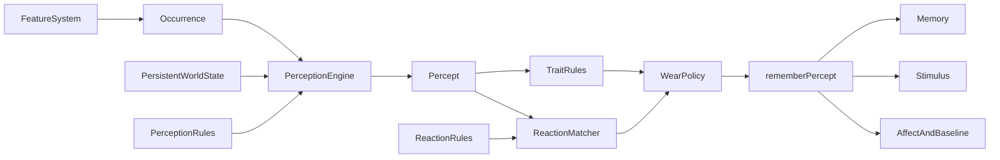

# Compositional perception and event rules

> Part of the [mars-sim documentation](./README.md).

## What it is

The content platform between simulation mechanics and colonist cognition.
Features emit small, reusable facts such as `colonist / kill / alien`; config
decides who can perceive those facts and how each percept changes memory,
affect, and attention. New combinations no longer require a dedicated Go enum
such as `SawAlien` or `WitnessedAlienKilled`.

This is the system that landed from PRs #33 and #35. It keeps the weighted
focus system and the occurrence/perception/reaction grammar; it ports mood wear
and per-colonist affect baselines; and it matches traits with the same grammar
instead of a tag vocabulary.

## Source

- [`internal/sim/perception.go`](../internal/sim/perception.go) — semantic
  vocabulary, occurrences, percepts, matching, sensory fan-out, line of sight,
  and persistent enter/ongoing/exit tracking.
- [`internal/sim/cognition_config.go`](../internal/sim/cognition_config.go) —
  perception, reaction, and trait-rule schemas; wear-policy IDs; validation;
  defaults; and authoring exports.
- [`internal/sim/world.go`](../internal/sim/world.go) — `rememberPercept`, the
  single reaction-to-cognition funnel.
- [`internal/sim/affect.go`](../internal/sim/affect.go) — wear-policy registry,
  grammar-matched trait scales, baselines, and the push/pull blend.
- [`internal/sim/stimulus.go`](../internal/sim/stimulus.go) — `RuleID`-keyed
  transient attention.
- [`cognition.yaml`](../cognition.yaml) — shipped vocabulary and rules.
- [`internal/sim/perception_rules_test.go`](../internal/sim/perception_rules_test.go)
  — configurable channels, range, line of sight, phases, and friend relation.

## Feature description

### One occurrence, several perspectives

The objective fact and the observer's relationship to it are separate:

```go
Occurrence{Actor, Action, Object, Location, Text, Appraisals}
Percept{Observer, Channel, Role, Phase, ObjectRelation, Occurrence}
```

The occurrence `colonist / converse / colonist` can produce:

- `direct / actor` for the speaker;
- `direct / target` for the listener;
- a future `hearing / witness` rule if someone should overhear.

`Channel` is `direct`, `sight`, `hearing`, or `proximity`. `Role` is `actor`,
`target`, or `witness`. `Phase` is `instant`, `enter`, `ongoing`, or `exit`.
`ObjectRelation` is observer-relative (`friend` today) and is computed from
affinity, not authored onto the occurrence. Nouns and actions are stable
kebab-case vocabulary IDs.

There is no tag list. Meaning lives in the typed grammar fields.

### Configurable perception

Perception rules match an occurrence and define how it reaches observers:

```yaml
perceptions:
  - id: visible-alien
    match: { actor_noun: alien, action: present }
    sense:
      { channel: sight, role: witness, radius: flee-radius,
        cadence: enter-and-ongoing }
```

Rules may use a named simulation radius or a fixed distance and may require
line of sight. Instant occurrences fan out when emitted. Persistent facts use
the chunk index (`entityIDsNearSorted`) plus a per-colonist cache: entering
emits `enter`, staying may emit `ongoing`, leaving emits `exit`, and returning
enters again.

LOS is computed only for a rule that asks for it, and only for in-range
candidates. If no loaded perception uses LOS, the Bresenham walk never runs.

Direct perception is instant and has no radius or LOS. The compiler rejects
anything else.

### Configurable reactions

Reaction rules map percepts to cognition:

```yaml
reactions:
  - id: witnessed-alien-killed
    match:
      { actor_noun: colonist, action: kill, object_noun: alien,
        channel: sight, role: witness, phase: instant }
    memory: { record: true }
    affect:
      { impact: 35,
        fresh: { charge: 5, grip: 6, valence: 4 },
        worn: { charge: 2, grip: 2, valence: 0 } }
    wear_policy: memory-occasions
```

A reaction can configure:

- memory recording, templates, and consecutive collapse;
- affect impact plus a `fresh`/`worn` pair;
- a wear-policy ID (`memory-occasions` or `none`);
- stimulus salience, lifetime, source identity, and focus contributions.

The immutable reaction ID is also the durable memory-collapse and
stimulus-coalescing identity.

### Grammar-matched trait rules

Traits match the same percept grammar. Empty fields are wildcards; matching
rules compose in YAML declaration order:

```yaml
trait_rules:
  - id: cowardly-global-wear
    trait: cowardly
    scales: { wear_rate: 180 }
  - id: cowardly-visible-alien
    trait: cowardly
    match: { actor_noun: alien, action: present, channel: sight, role: witness }
    scales: { impact: 150 }
  - id: extrovert-friend-killed
    trait: extrovert
    match:
      { actor_noun: alien, action: kill, object_noun: colonist,
        channel: sight, role: witness, object_relation: friend }
    scales: { charge: 130, valence: 150 }
```

Wear-rate scales run before the wear policy. Charge/grip/valence/impact scales
run after the policy resolves its target.

## Design



### Configuration boundary

Go remains the source of physical truth. Combat decides whether a shot kills,
work decides whether mining completed, and conversation computes its
participant-specific outcome. Config controls:

1. which channels and spatial conditions expose that fact to observers;
2. which cognitive reaction matches the resulting percept;
3. the memory, affect, stimulus, wear, and trait effects of that reaction.

Config does not script pathfinding, job claims, combat outcomes, or focus
eligibility.

### Matching and determinism

Rules are stored in declaration-order slices. A reaction winner is chosen by
priority, then pattern specificity. Equal-priority, equally specific
overlapping reactions are rejected during strict config loading. Trait rules
may overlap on purpose because they all compose.

Simulation math stays integer. Entity traversal remains sorted. Maps provide
exact lookup only and are not iterated for simulation ordering.

### Persistent context without a universal fact stream

The rejected design was a global database containing every relation on every
tick. It would allocate and match facts that no colonist consumes.

Instead:

- feature systems emit instantaneous occurrences once;
- persistent entity/environment observations are evaluated for each colonist
  through the chunk index;
- only currently perceived keys and their last occurrences are retained;
- ongoing perception refreshes attention without replaying affect or memory.

This preserves the useful distinction between “first saw an alien” and “the
alien is still demanding attention.”

The resting/sleeping cognition fast path still skips observation when only the
shipped persistent rules exist. Adding a custom persistent perception flips
`hasCustomPersistentPerception`, so a new “saw a cat” rule cannot be skipped
while a colonist rests.

### Wear as a policy, not a conversation exception

`memory-occasions` counts remembered entries whose `Memory.Rule` matches the
reaction — one entry per occasion, not `Memory.Count`. A collapsed mining run
is therefore one remembered occasion. `none` returns a contextual target when
present, otherwise `Fresh`. Conversation uses `none` so social fatigue stays
in `finishTalk` rather than being baked into `applyAffect`.

The registry is the seam for a future `relationship-conversation` policy. That
policy is not implemented here.

### Why not tags

PR #35 proposed events-carry-tags / traits-react-to-tags. That collapses
`t × e` into `t + e`, but it also invents a second vocabulary that has to stay
in sync with the grammar the perception layer already has. A Tidy rule that
matches `actor_noun: gore` or `action: kill` says the same thing without a
`gore` tag, and `object_relation: friend` is typed observer context rather than
a dynamic tag stamped at emit time.

Fatal bite emits the occurrence *before* the victim is removed so affinity and
friend relation still exist for witnesses.

## Why it is this way

- **Composition instead of combinations.** Actor/action/object plus
  channel/role avoids multiplying Go constants for every perspective.
- **Two rule layers.** What happened, whether someone perceived it, and how
  they interpreted it are separate decisions.
- **Stable string identity.** Config, memories, and stimuli remain readable and
  durable when implementation details change.
- **Strict loading.** Authoring errors fail at startup instead of silently
  producing missing cognition.
- **No expression DSL and no tags.** Typed patterns, contextual targets, and
  a wear-policy registry cover current content without a second language or a
  parallel vocabulary.

## Extending it

For a new feature:

1. add reusable noun/action vocabulary where needed;
2. emit one occurrence at the mechanic's point of truth;
3. add direct or sensory perception rules;
4. add reactions for the participant and witness perspectives that matter;
5. add grammar-matched trait rules if a trait should change the appraisal;
6. tune in the Cognition Lab;
7. add parity and edge-transition tests, then run `go test ./...`.

Preserve stable rule IDs, sorted traversal, integer appraisal math, and the
single ingestion funnel. If a reaction needs its own repetition semantics,
register a wear policy — do not special-case it in `rememberPercept`.

## Related

- [cognition-config-and-lab.md](./cognition-config-and-lab.md) — authoring
  schema and tool workflow.
- [memories.md](./memories.md) — durable reaction identity and collapse.
- [affect.md](./affect.md) — appraisal, wear, baselines, and trait rules.
- [personality.md](./personality.md) — spawn-resolved trait mechanics and the
  new nerve/outlook groups.
- [cascading_wsts_architecture.md](./cascading_wsts_architecture.md) — how
  affect and stimuli feed focus arbitration.
