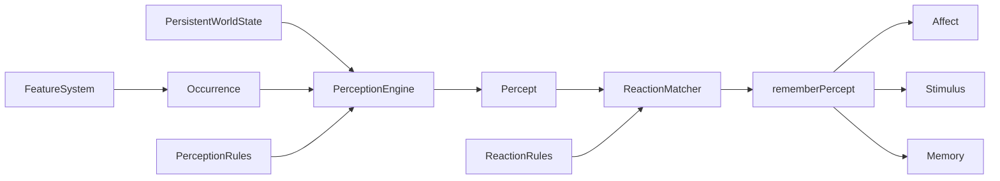

# Compositional perception and event rules

> Part of the [mars-sim documentation](./README.md).

## What it is

The content platform between simulation mechanics and colonist cognition.
Features emit small, reusable facts such as `colonist / kill / alien`; config
decides who can perceive those facts and how each percept changes memory,
affect, and attention. New combinations no longer require a dedicated Go enum
such as `SawAlien` or `WitnessedAlienKilled`.

## Source

- [`internal/sim/perception.go`](../internal/sim/perception.go) — semantic
  vocabulary, occurrences, percepts, matching, sensory fan-out, and persistent
  enter/ongoing/exit tracking.
- [`internal/sim/cognition_config.go`](../internal/sim/cognition_config.go) —
  perception, reaction, and modifier rule schemas; validation; defaults; and
  authoring exports.
- [`internal/sim/world.go`](../internal/sim/world.go) — `rememberPercept`, the
  single reaction-to-cognition funnel.
- [`internal/sim/affect.go`](../internal/sim/affect.go) and
  [`internal/sim/stimulus.go`](../internal/sim/stimulus.go) — consumers of the
  resolved reaction.
- [`cognition.yaml`](../cognition.yaml) — shipped vocabulary and rules.
- [`internal/sim/perception_rules_test.go`](../internal/sim/perception_rules_test.go)
  — configurable channels, range, line of sight, phases, and dynamic tags.

## Feature description

### One occurrence, several perspectives

The objective fact and the observer's relationship to it are separate:

```go
Occurrence{Actor, Action, Object, Location, Tags}
Percept{Observer, Channel, Role, Phase, Occurrence}
```

The occurrence `colonist / play / cat` can produce:

- `direct / actor` for the colonist playing;
- `sight / witness` for someone watching;
- `hearing / witness` for someone close enough to hear.

`Channel` is `direct`, `sight`, `hearing`, or `proximity`. `Role` is `actor`,
`target`, or `witness`. `Phase` is `instant`, `enter`, `ongoing`, or `exit`.
Nouns, actions, and tags are stable kebab-case vocabulary IDs.

### Configurable perception

Perception rules match an occurrence and define how it reaches observers:

```yaml
perceptions:
  - id: visible-alien
    match: { actor_noun: alien, action: present }
    sense:
      { channel: sight, role: witness, radius: flee-radius,
        cadence: enter-and-ongoing }
```

Rules may use a named simulation radius or a fixed distance and may require
line of sight. Instant occurrences fan out when emitted. Persistent facts use a
per-colonist cache: entering emits `enter`, staying may emit `ongoing`, leaving
emits `exit`, and returning enters again.

### Configurable reactions

Reaction rules map percepts to cognition:

```yaml
reactions:
  - id: witnessed-alien-killed
    match:
      { actor_noun: colonist, action: kill, object_noun: alien,
        channel: sight, role: witness, phase: instant }
    memory: { record: true }
    affect:
      { impact: 35, target: { charge: 5, grip: 6, valence: 4 } }
```

A reaction can configure:

- memory recording, templates, and consecutive collapse;
- affect impact and charge/grip/valence target;
- stimulus salience, lifetime, source identity, and focus contributions;
- tags consumed by personality modifiers.

The immutable reaction ID is also the durable memory-collapse and
stimulus-coalescing identity.

### Configurable trait modifiers

Traits match reaction or occurrence tags instead of enumerating every event:

```yaml
modifiers:
  - id: tidy-gore
    trait: tidy
    any_tags: [gore]
    scales: { impact: 100, charge: 220, grip: 220, valence: 220 }
```

Occurrence-level dynamic tags allow contextual reactions without defining a
new global event kind.

## Design



### Configuration boundary

Go remains the source of physical truth. Combat decides whether a shot kills,
work decides whether mining completed, and conversation computes its
participant-specific outcome. Config controls:

1. which channels and spatial conditions expose that fact to observers;
2. which cognitive reaction matches the resulting percept;
3. the memory, affect, stimulus, and trait effects of that reaction.

Config does not script pathfinding, job claims, combat outcomes, or focus
eligibility.

### Matching and determinism

Rules are stored in declaration-order slices. A reaction winner is chosen by
priority, then pattern specificity. Equal-priority, equally specific
overlapping reactions are rejected during strict config loading.

Simulation math stays integer. Entity traversal remains sorted. Maps provide
exact lookup only and are not iterated for simulation ordering. Stimulus
eviction retains a total salience/expiry/source ordering.

### Persistent context without a universal fact stream

The rejected design was a global database containing every relation on every
tick. It would allocate and match facts that no colonist consumes.

Instead:

- feature systems emit instantaneous occurrences once;
- persistent entity/environment observations are evaluated for each colonist;
- only currently perceived keys and their last occurrences are retained;
- ongoing perception refreshes attention without replaying affect or memory.

This preserves the useful distinction between “first saw an alien” and “the
alien is still demanding attention.”

### One cognition funnel

`rememberPercept` resolves one base reaction and sends the same interpretation
to affect, stimulus, and memory. Ongoing context is the narrow exception: it
reuses the enter reaction only to refresh stimulus state.

Memory and stimulus identity use `RuleID`, replacing the deleted
`LifeEventKind` arrays and parsers. A stimulus additionally selects
`source: actor`, `object`, or `none`, preserving distinct alien context while
allowing routine work to coalesce.

### Contextual outcomes

Most targets are static config. Conversation quality depends on live affinity,
quality, and each participant's fatigue, so the feature attaches a
per-observer target to the shared occurrence. That target still passes through
the normal reaction, modifier, and push/pull pipeline.

### Authoring

The Cognition Lab is both a top-to-bottom cognition simulator and a typed rule
editor. It imports the generated vocabulary/schema, edits perception and
reaction rules with stable IDs, validates references, and round-trips the
runtime YAML. See [cognition-config-and-lab.md](./cognition-config-and-lab.md)
for commands and UI workflow.

## Why it is this way

- **Composition instead of combinations.** Actor/action/object plus
  channel/role avoids multiplying Go constants for every perspective.
- **Two rule layers.** What happened, whether someone perceived it, and how
  they interpreted it are separate decisions.
- **Stable string identity.** Config, memories, and stimuli remain readable and
  durable when implementation details change.
- **Strict loading.** Authoring errors fail at startup instead of silently
  producing missing cognition.
- **No expression DSL.** Typed patterns, contextual targets, and dynamic tags
  cover current content without adding a second programming language.

## Extending it

For a new feature:

1. add reusable noun/action/tag vocabulary where needed;
2. emit one occurrence at the mechanic's point of truth;
3. add direct or sensory perception rules;
4. add reactions for the participant and witness perspectives that matter;
5. tune in the Cognition Lab;
6. add parity and edge-transition tests, then run `go test ./...`.

Preserve stable rule IDs, sorted traversal, integer appraisal math, and the
single ingestion funnel.

## Related

- [cognition-config-and-lab.md](./cognition-config-and-lab.md) — authoring
  schema and tool workflow.
- [memories.md](./memories.md) — durable reaction identity and collapse.
- [affect.md](./affect.md) — appraisal and trait/tag modifiers.
- [cascading_wsts_architecture.md](./cascading_wsts_architecture.md) — how
  affect and stimuli feed focus arbitration.
